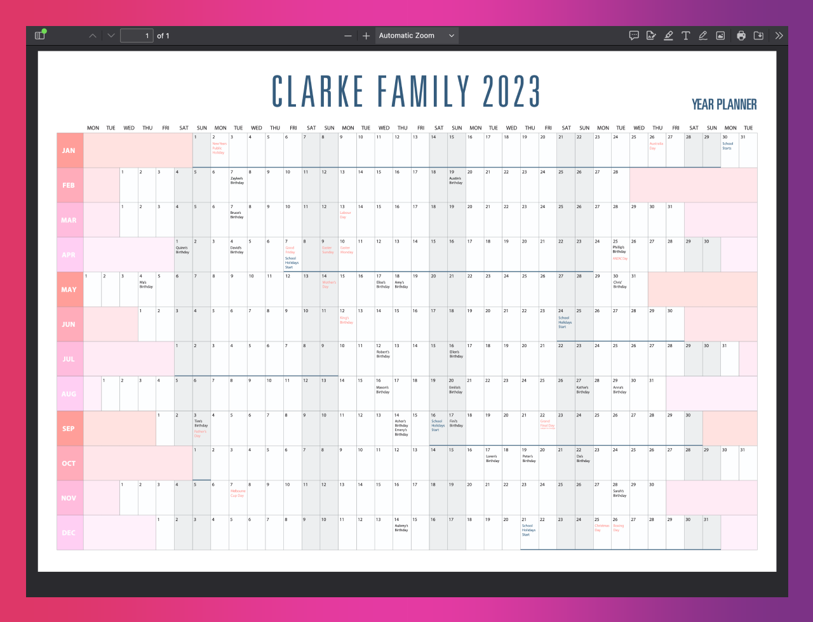

import IconButton from "../../../components/IconButton.astro";

## {frontmatter.title}

#### Python Development
    
Create aesthetically pleasing yearly planners to schedule dates and projects.

    <IconButton href={frontmatter.repoURL} text="Source Code" icon="simple-icons:github" />
    <IconButton href={frontmatter.demoURL} text="Visit Website" icon="material-symbols:arrow-outward-rounded" />

Nullam eget fringilla metus. Fusce dui ex, luctus aliquam justo sit amet, hendrerit suscipit lorem. Aliquam fringilla aliquam magna, a commodo sapien maximus vel. Donec a libero leo. Etiam condimentum, ligula sed accumsan tempus, ex nisi auctor nisi, quis hendrerit sem tortor ut magna. Praesent sodales lacus et ligula dapibus tincidunt. Nunc sed ipsum sit amet dui laoreet luctus vitae at tellus. 

