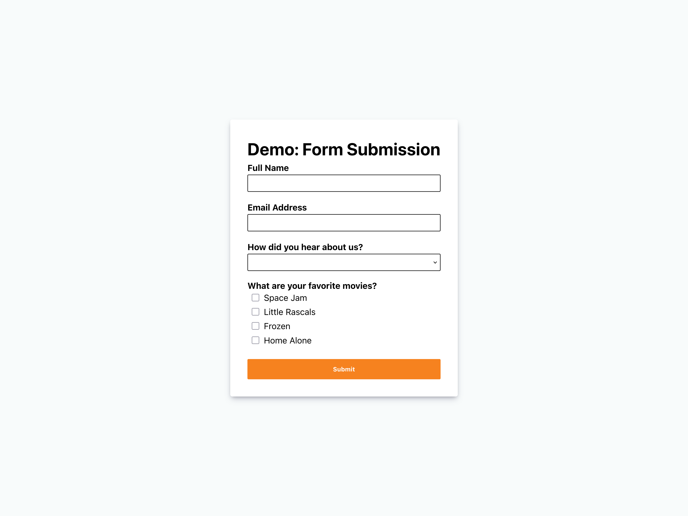

import IconButton from "../../../components/IconButton.astro";

## {frontmatter.title}

#### Serverless Development

Send emails over Cloudflare Pages.

Lorem ipsum dolor sit amet, consectetur adipiscing elit. Ut congue cursus justo a pretium. Aenean vel turpis sed dolor lobortis mattis eget lobortis libero. Morbi ultricies pharetra neque a blandit. Maecenas pellentesque fringilla feugiat. Donec eu finibus nisl, vel egestas purus. Vestibulum pellentesque ex eget diam euismod rutrum non fringilla velit. Fusce nunc ligula, mollis eu rhoncus sed, consequat eu nisi. Phasellus sagittis dignissim pretium. Nulla scelerisque magna quis ex hendrerit, sagittis varius magna cursus. In blandit nulla in mi tincidunt, non scelerisque ante mattis.

Nullam eget fringilla metus. Fusce dui ex, luctus aliquam justo sit amet, hendrerit suscipit lorem. Aliquam fringilla aliquam magna, a commodo sapien maximus vel. Donec a libero leo. Etiam condimentum, ligula sed accumsan tempus, ex nisi auctor nisi, quis hendrerit sem tortor ut magna. Praesent sodales lacus et ligula dapibus tincidunt. Nunc sed ipsum sit amet dui laoreet luctus vitae at tellus. 

    <IconButton href={frontmatter.repoURL} text="Source Code" icon="simple-icons:github" />
    <IconButton href={frontmatter.demoURL} text="Visit Website" icon="material-symbols:arrow-outward-rounded" />

